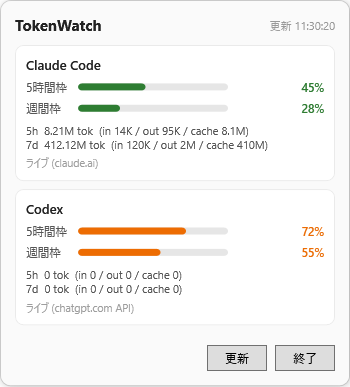
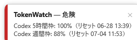

# TokenWatch


**Claude Code** と **Codex** の使用量（公式の 5時間 / 週 limit% とトークン量）を、Windows のタスクトレイから一目で確認できる常駐アプリです。

> A Windows tray app that shows your **Claude Code** and **Codex** usage — live 5‑hour / weekly limit % and token counts. Inspired by the macOS app [AgentLimits](https://github.com/Nihondo/AgentLimits).

<p align="center">
  
  &nbsp;
  
</p>

> ※ スクリーンショットの数値はサンプルです。

---

## ⚠️ 免責 / Disclaimer

TokenWatch は**非公式**の個人向けツールで、Anthropic / OpenAI とは一切関係ありません。
使用量は、お使いの PC にある **Claude Code / Codex のローカル設定**と、**あなた自身の認証済みセッション**で各社の Web エンドポイントを呼び出して取得します。これらのエンドポイントは**非公開で予告なく変わる可能性**があり、動作を保証するものではありません。自己責任でご利用ください。

## 機能

- タスクトレイ常駐。現在の 5時間枠使用率を**動的アイコン**（数値＋色：緑→橙→赤）で表示
- クリックで両プロバイダのダッシュボード（5h / 週のバー、リセット時刻、トークン量）
- **公式 limit% をライブ取得**
  - **Codex**: `~/.codex/auth.json` の既存トークンで ChatGPT の usage API を呼び出し（追加ログイン不要）
  - **Claude Code**: 内蔵 WebView2 で claude.ai に一度ログイン（セッション保存・以降は自動）
- トークン量（直近5h / 7d / 累計）をローカルの JSONL ログから集計
- しきい値超え時の**アプリ内トースト通知**（システム通知設定に依存せず必ず表示）
- 自動更新（既定 2 分）／手動更新／Windows 起動時の自動起動

## 動作要件

- Windows 10 / 11（x64）
- [WebView2 ランタイム](https://developer.microsoft.com/microsoft-edge/webview2/)（Windows 11 は標準同梱。Claude のライブ取得に必要）
- 使用量を出したいツール（[Claude Code](https://www.claude.com/product/claude-code) / [Codex](https://openai.com/codex/)）でログイン済みであること

## インストール

### 方法 A: ビルド済み exe（推奨）
[Releases](../../releases) から `TokenWatch.exe` をダウンロードし、任意のフォルダ（例: `C:\Tools\TokenWatch\`）に置いて実行するだけ。自己完結ビルドなので .NET ランタイムは不要です。

### 方法 B: 自分でビルド
[.NET 8 SDK](https://dotnet.microsoft.com/download/dotnet/8.0) が必要です。

```sh
git clone https://github.com/<your-account>/TokenWatch.git
cd TokenWatch
dotnet run --project TokenWatch.App
```

## 使い方

1. アプリを起動するとタスクトレイに常駐します（Windows 11 では「∧」の隠れているアイコンの中）。
2. **Codex** はログイン不要 — 既存の Codex CLI 認証を自動で読み取ります。
3. **Claude Code** はトレイ右クリック →「**Claude にログイン**」→ claude.ai にログイン。完了は自動検知され、ウィンドウは自動で閉じます（以降は再ログイン不要）。
4. トレイ右クリックで `詳細を表示 / 今すぐ更新 / Claude にログイン / 自動起動 / しきい値超えを通知 / 設定フォルダを開く / 終了`。

## 設定

`%LOCALAPPDATA%\TokenWatch\settings.json`（トレイメニュー「設定フォルダを開く」から到達可）:

```json
{
  "PollIntervalMinutes": 2,
  "WarnPercent": 50,
  "CriticalPercent": 80,
  "StartWithWindows": false,
  "NotificationsEnabled": true
}
```

`WarnPercent` / `CriticalPercent` がバー・数値・アイコンの色（緑 / 橙 / 赤）と通知レベルのしきい値です。

## プライバシー / セキュリティ

- 認証情報（パスワード・トークン）を TokenWatch が保存・送信することはありません。Claude のログインは WebView2 内で行われ、セッションは `%LOCALAPPDATA%\TokenWatch\WebView2` のローカルプロファイルにのみ保存されます。
- Codex は `~/.codex/auth.json` の既存アクセストークンを読み取り、**取得した使用量を表示する目的でのみ** ChatGPT の usage エンドポイントに送ります。第三者への送信は行いません。
- すべての通信は各プロバイダの公式ドメイン（claude.ai / chatgpt.com）に対してのみ行われます。

## 開発

3 プロジェクト構成です。

| プロジェクト | 役割 |
|---|---|
| `TokenWatch.Core` | UI 非依存のコア（モデル / コレクタ / API クライアント / パーサ） |
| `TokenWatch.App` | WPF + WinForms(NotifyIcon) のトレイアプリ（WebView2 ログイン、ダッシュボード、通知、設定） |
| `TokenWatch.Cli` | 使用量を標準出力する検証用コンソール |

```sh
dotnet build TokenWatch.sln -c Debug
dotnet run --project TokenWatch.Cli      # CLI で確認

# 配布用の単一 exe（自己完結 / .NET ランタイム不要）
dotnet publish TokenWatch.App/TokenWatch.App.csproj -c Release -r win-x64 \
  --self-contained true -p:PublishSingleFile=true \
  -p:IncludeNativeLibrariesForSelfExtract=true -p:EnableCompressionInSingleFile=true
```

## ライセンス

[Apache License 2.0](LICENSE) © 2026 takagiko

## 謝辞

macOS 向けの [AgentLimits](https://github.com/Nihondo/AgentLimits) にインスパイアされています。
